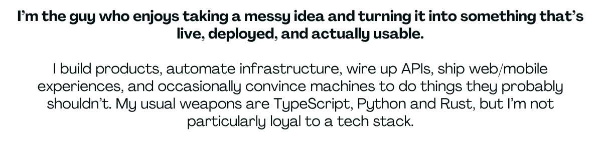
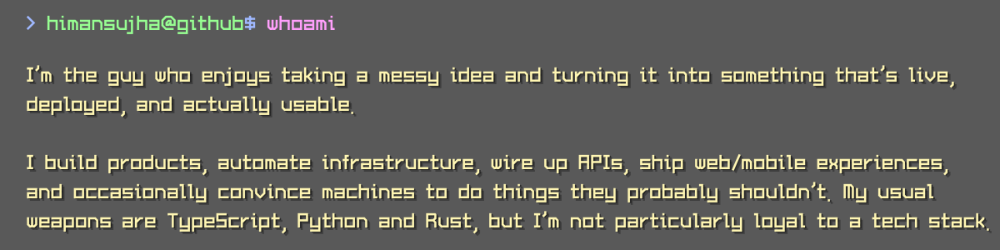
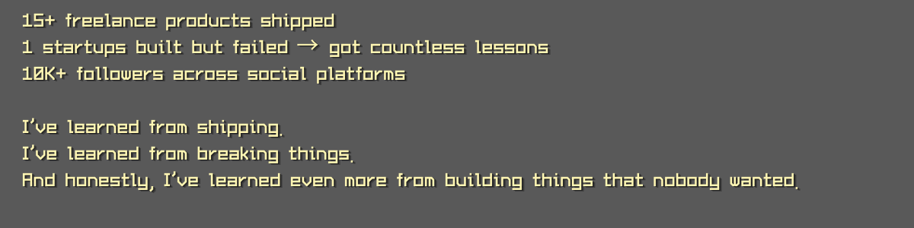
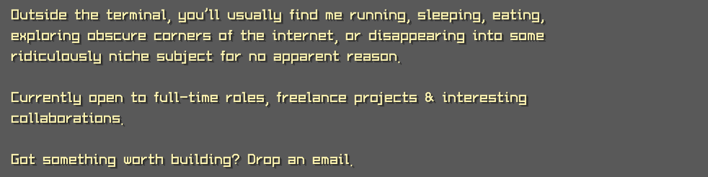
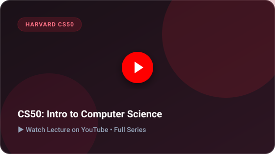

  <picture>
    <source media="(prefers-color-scheme: dark)" srcset="https://raw.githubusercontent.com/himansujha/himansujha/output/github-contribution-grid-snake-dark.svg">
    <source media="(prefers-color-scheme: light)" srcset="https://raw.githubusercontent.com/himansujha/himansujha/output/github-contribution-grid-snake.svg">
    
  </picture>

 

  <h2>📺 Watch My Videos on YouTube</h2>
   

  <table>
    <tr>
      <td width="50%" align="center">
        
      </td>
      <td width="50%" align="center">
        
      </td>
    </tr>
    <tr>
      <td width="50%" align="center">
        
      </td>
      <td width="50%" align="center">
        
      </td>
    </tr>
  </table>

   

  

    ✨ <b>For more, <a href="https://www.youtube.com" target="_blank">click here</a></b> ✨
  

